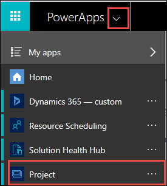

# Delete user data from Project for the web

To delete user data from Project for the web, you need the user's Azure AD Object ID. You can get this by checking the user's profile properties in Azure AD or by using [Get-AzureADUser](https://docs.microsoft.com/powershell/module/azuread/get-azureaduser).

## To find a user's roadmaps

1. In the [Microsoft 365 admin center](https://admin.microsoft.com), under **Admin centers**, click **Dynamics 365**.
2. In the Dynamics 365 Administraton Center, select the default instance, and then click **Open**.
3. Click **Advanced Find**.
4. From the **Look for** menu, choose **Roadmaps**.
5. Click **Edit Columns**
6. Click **Add Columns**.
7. Choose the columns below that you want to search on. Be sure to include **Office 365 Group AAD ID**.

   |**Display name**|**Description**|
   |:---------------|:--------------|
   |Name|Name of the roadmap.|
   |Order Hint|Ordering of the roadmap rows within a roadmap.|
   |Owner AAD ID|ID of the user in AAD who owns the roadmap.|
   |Parent Roadmap|ID of the parent roadmap.|
   |Creator AAD ID|ID of the user in AAD who created the roadmap.|
   |Office 365 Group AAD ID|ID of the roadmap's Office 365 group in AAD.|
   |Roadmap|Unique identifier of a roadmap.|
   |Roadmap Type|The type of roadmap record.|

8. Click **OK**, and then click **OK** again.
9. In the **Fields** list, choose **Owner AAD Id** and type in the user's Azure AD Object ID.
10. Click **Results**.

Make note of the Office 365 Group AAD ID for any roadmap that you want to make changes to. You must join this group as an owner in order to make updates to the roadmap.

To add yourself as a group owner, use [Add-AzureADGroupOwner](https://docs.microsoft.com/powershell/module/azuread/add-azureadgroupowner):

`Add-AzureADGroupOwner -ObjectId <GroupID> -RefObjectId <YourAADObjectID>`

For example,

`Add-AzureADGroupOwner -ObjectId "62438306-7c37-4638-a72d-0ee8d9217680" -RefObjectId "0a1068c0-dbb6-4537-9db3-b48f3e31dd76"`

Once you are an owner for the groups, you can open the roadmaps from Project Home and make edits or deletions directly. ([Roadmap must be enabled](turn-roadmap-on-or-off.md) to do this.)

### For roadmaps not associated to an Office 365 group

If your user's roadmap is not associated to an Office 365 group, and you want to be able to delete or make edits to it, you need add a group that you own to the roadmap.

This first requires you to create an Office 365 Group and get the Office 365 Group AAD id value for it.  After you do this, do the following:

1. In the Advanced Find search results, click the name of the roadmap to open it in Dynamics 365.
2. In the Roadmap Information page in Dynamics 365, click the menu item with three dots, and in the menu select **Flow**, and then select **Form Editor**.
3. In the Form Editor, select **Office 365 Group AAD id** from the Unused Fields list, and drag and drop it to the **General** section of the form, under Owner. 
4. Click **Save** and then **Publish**.
5. After the change in completed, on the Roadmap Information page, you will see the Office 365 Group AAD id field display. Enter the Office 365 Group AAD ID value of the group you own into the field box.

You are now the owner of the Office 365 Group for the roadmap and can edit or delete it.

## To find a user's projects

1. In the [Microsoft 365 admin center](https://admin.microsoft.com), under **Admin centers**, click **Dynamics 365**.
2. In the Dynamics 365 Administration Center, select the default instance, and then click **Open**.
3. Click **Advanced Find**.
4. From the **Look for** menu, choose **Projects**.
5.	To begin building your query, click **Select**, and then select the fields you need to start searching for projects your user was a part of. You will need the users AAD ID or account name.  For example:
    -	To find all projects owned by the user, select the Owner field, and then select Equals, and then enter the account name for the user.
    -	To find all projects created by the user, select the Created By field, and then select Equals, and then enter the account name for the user.

6. When you are done with selecting your search criteria, in the ribbon, select **Edit Columns**.
7. On the Edit columns page, select **Add columns**, and then select the columns you want to include in the query.  When done, click **OK**.
8. Click **Results** to run your query.

### To delete or edit a project

To delete or edit a users project, do the following:

1. From the Advanced Find search results list, note the project you want to delete or update.
2. On the PowerApps admin page, click the drop-down menu and select **Project**. 

3. On the Project page, in the **System Views** menu, select **All Projects**.
4. Click on the project you are interested in deleted or redacting.
5. On the project page, you can choose to:
    - Click **Delete** to delete the project.
    - Click **Tasks** to update the the project's tasks.

## See Also

[Create, edit, or save an Advanced Find search](https://docs.microsoft.com/dynamics365/customer-engagement/basics/save-advanced-find-search)

[Export user data from Project for the web](export-user-data-from-project-for-the-web.md)

[Delete user data from Project Online](delete-user-data-from-project-online.md)
  
  

