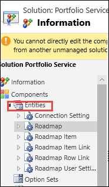
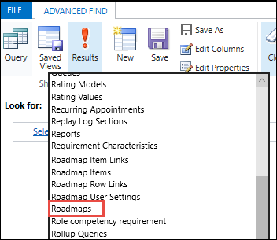
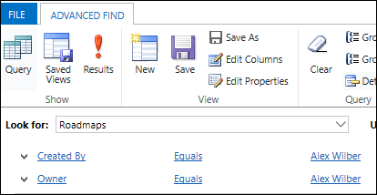

# Export user data from Project for the web

This article describes how a Microsoft 365 tenant admin can export a specific user’s data from Project for the web. The admin can then choose to view the user’s data and decide what data they want to make available to the user. 

Project for the web data is stored in the [Common Data Service (CDS)](https://docs.microsoft.com/powerapps/maker/common-data-service/data-platform-intro) in Microsoft PowerApps. This article describes how you can:  

- View a specific user’s Project for the web data by using the Advanced Find function in Dynamics 365.  
- Use a PowerShell script to export data about specific projects that your user was a part of.   

    
## Requirements
  
You will need the following in order to look for data on a specific user through the Advanced Find search feature: 
- You need the Azure Active Directory ID (AAD ID) of the user. You can find it in the Azure Active Directory Admin Center.  
- You need to be a global admin in your Microsoft 365 tenant. You need this to access the Dynamics 365 Admin Center.  

If you also want to export and view information on specific projects: 
- You need to be a tenant admin.
- You need a copy of Project Professional 2016, Project Professional 2019, or the Project Online Desktop Client if you want to view your user’s projects.  If you do not have one available, you can [sign up for a trial](https://go.microsoft.com/fwlink/p/?LinkID=403844&culture=en-US&country=US). 
  

## Methods for finding your user's data

Depending on the type of user data you need to find, there are two paths you can take in searching for and exporting your user's data.

- **Find data about your users project and roadmap objects in CDS** - Use the Advanced Find feature in the Dynamics 365 Admin Center to find all the users data that is contained in CDS (for example, objects related to their projects and roadmaps).
- **Find data about specific projects that your user was associated with** - Use the project export PowerShell script to get details about specific projects the user was associated with.

## Find user data in CDS with the Advanced Find search feature 

Project for the web user information that resides in CDS - such as roadmap and project objects and properties - are located in specific Dynamics 365 solutions.  The Advanced Find search feature in the Dynamics 365 admin center can query across entities in these solutions to find the information you need.

### Understand Project for the web CDS data and where it resides

When looking for a specific users Project for the web data in Dynamics 365 CDS, it is located in these five Dynamics 365 solutions:

|||
|:-----|:-----|
|**Name**   |**Display Name**   |
|PortfolioService    |Portfolio Service    |
|msdyn_ProjectServiceCore   |Project Service Automation Core    |
|MicrosoftDynamicsScheduling    |Universal Resource Scheduling   |
|msdynce_SchedulingPatch    |Scheduling Patch   |
|mydynce_Scheduling   | Scheduling   |

You can look specifically at any of these Dynamics 365 solutions to get an idea of the entities that exist for it. Understanding the entities that exist for a specific solution can help you with understanding what to look for in your query.

To view entities for a Dynamics 365 solution:
1. In the Microsoft 365 admin center, under **Admin centers**, click **Dynamics 365**.
2. In the Dynamics 365 Administration Center, select the default instance, and then click **Open**.

    
3. On the Dynamics 365 Settings page, click the **Settings** menu, and in the **Customization** section, select **Solutions**.
4. On the All Solutions page, click on the Display Name of the solution that you are interested in.

     
5.  On the solution information page, expand **Entities** to view them.

     
6. Under each entity, you can select specific objects to get more details about its properties.

### Use Advanced Find to search for user data

Use [Dynamics 365 Advanced Find search](https://docs.microsoft.com/dynamics365/customer-engagement/basics/save-advanced-find-search) to look for  Project for the web data for your user. Advanced Find will search across all solutions in your CDS instance. You can then download the results directly to an Excel spreadsheet and determine what to provide to your user.

1.	In the Dynamics 365 Administration Center, select the default instance, and then click **Open**.
2.	On the Dynamics 365 Settings page, click the **Settings** menu, and in the **Customization** section, select **Solutions**.
3.	Click the **Advance Find** button.

    
4.	In Advanced Find, in the **Look for** menu, select the objects that you want to search for, such as your user's projects or roadmaps.
    
    For example, if you want to view all roadmaps your user was a part of, select **Roadmaps**.

    
5.	To begin building your query, click **Select**, and then select the fields you need to start searching for projects or roadmaps your user was a part of. You will need the users AAD ID or account name.  

    For example:
    -	To find all roadmaps owned by the user, select the Owner field, and then select Equals, and then enter the account name for the user.
    -	To find all roadmaps created by the user, select the Created By field, and then select Equals, and then enter the account name for the user.

        
6. When you are done with selecting your search criteria, in the ribbon, select **Edit Columns**.
7. On the Edit columns page, select **Add columns**, and then select the columns you want to include in the query.  When done, click **OK**.
8. Click **Results** to run your query.
9. After you receive your results, you can export them to Excel.  To do this, click **Export**, and then select **Static Worksheet**.  

You can then review the results to determine what data you'd like to provide to the user.

## Use the export script to see details on specific projects

If you need to look for more details that are contained in specific projects that the user was associated with, you can use the ExportProjectContent  Powershell script to get more information on each project. With the script, you can get the following files for a specific project:

- Project files (.MPP) for the project.
- An XML file that contains project details and settings.

### Get the Project IDs of the projects you are interested in

Before you run the script, you need to the Project IDs of the projects you are interested in.

Assuming you've used Advanced Find search to query for the user's projects and have downloaded the them to an Excel file, the Project ID column is the first column in the Excel spreadsheet, but it is hidden by default.  Unhiding the first column can be a bit tricky, so if you need help, see [Unhide the first row or column in a worksheet](https://support.office.com/article/unhide-the-first-column-or-row-in-a-worksheet-d6b47608-80ee-4021-9b51-6a1f57269ec9#ID0EAABAAA=Windows).

After you unhide the columns in the spreadsheet, looks for the name of the project, and then look for the corresponding value in the Project column to find the Project ID for the project.

### Run the Export script

Now that you have the Project IDs of the projects you are interested in looking at, use the **ExportProjectContent.ps1** Windows PowerShell script get more information. The ExportProjectUserContent PowerShell script is included with the Project User Content Export script package.

[Download the ExportProjectContent Windows PowerShell script](https://go.microsoft.com/fwlink/?linkid=2106330) and unzip the files.

> [!NOTE]
> After you unzip the script, run the following in Windows PowerShell to import the modules:
>
> Import-Module -Name ./projectonlineAdmin

To run the ExportProjectContent script:
1. In Windows PowerShell, run the following: 

    .\ExportProjectContent.ps1 -ProjectID (ProjectID of the project) -OutputDirectory (Location to put files) -InstanceId "(CDS instance name)"

    You will need to configure the following parameters when running the script:

    |||
    |:-----|:-----|
    |**Parameter**   |**Description**   |
    |ProjectId     |GUID of the project within CDS.  You learned how to find this in the previous section.     |
    |OutputDirectory    |Location where the export files are put.     |
    |InstanceId     |The identifier of the Dynamics 365 instance you are using.   |

    To find your Instance ID:

    a. In the Dynamics 365 Administration Center, select the default instance, and then click **Open**.

     
    b. On the PowerApps setting page, look at the first part of the URL to determine your Instance ID value. In the graphic below, the Instance ID value would be <spam><spam>https://orgde6d15d8.crm.dynamics.com<spam><spam>.

     

    

    As an example of how to run the script, if the Project ID of the project is dd065460-02b8-e911-a989-000d3a170e10, you want the output files to go to C:\User1Project1, and the instance name of the CDS org is https://<spam><spam>https://orgde6d15d8.crm.dynamics.com<spam><spam>, you would run the script like this:

    .\ExportProjectContent.ps1 -ProjectID dd065460-02b8-e911-a989-000d3a170e10 -OutputDirectory C:\User1Project1 -InstanceId https://<spam><spam>https://orgde6d15d8.crm.dynamics.com<spam><spam>"

2. When the script completes, go to the OutputDirectory location you specified to find the .XML and .MPP files for the project.
3. If you have multiple projects, run the script again for each project, using it’s corresponding ProjectID value.

Both the .XML and .MPP files that are created will be prefixed with the project’s Project ID.  For example, if the Project ID value is dd065460-02b8-e911-a989-000d3a170e10, the file names for the exported data will be:

- dd065460-02b8-e911-a989-000d3a170e10.XML
- dd065460-02b8-e911-a989-000d3a170e10.MPP

Note that you may receive multiple versions of your .MPP file, known as snapshots. These are versions of your project file prior to changes being made to it. Snapshot files will include a timestamp to let you know when they were taken.

All snapshots currently stored for the project are exported.  Snapshots can be periodically cleared out depending on how active the project is.

### View data contained in the project file (.MPP)

Using Project client software, you can open and view the project file to find information that you might want to provide the user.

You can view the users project file by using one of the following Project clients:
- Project Online Desktop Client (you have this if you have a Project Online Professional or Project Online Premium license).
- Project Professional 2019
- Project Professional 2016

You can get a free trial version of the Project Online Desktop Client by getting the [free trial version of Project Online Professional](https://www.microsoft.com/p/project-online-professional/CFQ7TTC0K8V1?SilentAuth=1&wa=wsignin1.0&activetab=pivot:overviewtab).

> [!NOTE]
> You will only be able to view the project file.  You will not be able to edit the .MPP file in any way.

### View data contained in the project XML file

The XML file contains a number of properties pertaining to the specific project. You can see the [Project XML Interchange Schema Reference](https://go.microsoft.com/fwlink/?linkid=872233) to understand the XML data contained in this file. 

## See Also

[Create, edit, or save an Advanced Find search](https://docs.microsoft.com/dynamics365/customer-engagement/basics/save-advanced-find-search)

[Delete user data from Project for the web](delete-user-data-from-project-for-the-web.md)

[Export user data from Project Online](export-user-data-from-project-online.md)
  
  

