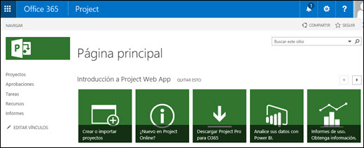
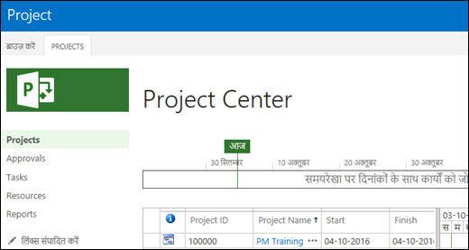

# Supported languages for Project Online

 *[\< More Project help](project-help.md)* 
  
When you [set up a Project Online site](set-up-another-project-online-site.md), you need to select a language in which the site will display. If you are in an environment in which you need to set up Project Online sites for multiple languages, you need to know:
  
- [Which languages are supported by Project Online?](supported-languages-for-project-online.md#lang)
    
- [What happens if I select a language that is not supported by Project Online?](supported-languages-for-project-online.md#happens)
    
## Which languages are supported by Project Online?

Project Online supports the following language. If you create your Project Online site and select one of the following languages, Project Online will display in the selected language.
  
> [!NOTE]
> SharePoint Online supports all of the languages that are supported by Project Online. 
  
|**Language**|**ll-cc**|**Locale ID (LCID)**|
|:-----|:-----|:-----|
|Arabic    |ar-sa    |1025    |
|Brazilian    |pt-br    |1046    |
|Chinese (PRC)    |zh-cn    |2056    |
|Chinese (Taiwan)    |zh-tw    |1028    |
|Czech    |cs-cz    |1029    |
|Danish    |da-dk    |1030    |
|Dutch    |nl-nl    |1043    |
|Engish (US)    |en-us    |1033    |
|Finnish    |fi-fi    |1035    |
|French    |fr-fr    |1036    |
|German    |de-de    |1031    |
|Greek    |el-gr    |1032    |
|Hebrew    |he-il    |1037    |
|Hungarian    |hu-hu    |1038    |
|Italian    |it-it    |1040    |
|Japanese    |ja-jp    |1041    |
|Korean    |ko-kr    |1042    |
|Norwegian    |nb-no    |1044    |
|Polish    |pl-pl    |1045    |
|Portuguese (Brazil)    |pt-br    |1046    |
|Portuguese (Portugal)    |pt-pt    |2070    |
|Romanian    |ro-ro    |1048    |
|Russian    |ru-ru    |1049    |
|Slovak    |sk-sk    |1051    |
|Slovenian    |sl-si    |1060    |
|Spanish    |es-es    |3082    |
|Swedish    |sv-se    |1053    |
|Turkish    |tr-tr    |1055    |
|Ukrainian    |uk-ua    |1058    |
   
## What happens if I select a language that is not supported by Project Online?

Project Online sites are built on SharePoint Online. When you create a new Project Online site, all of the languages that are listed in the **Select a language** list are those that are supported by SharePoint Online. 
  
However, Project Online does not support all of the languages that SharePoint Online supports. If Project Online does not support a language that is supported by SharePoint Online, Project Online will display its interface in an alternate language.
  
If you select a language that is supported by Project Online, the Project Online and SharePoint Online interface provided through the site will display in the selected language. For example, in the graphic below, Spanish was the selected language, and all components on the Project Online page (SharePoint Online and Project Online) will display in Spanish.
  

  
If you select a language that is not supported by Project Online, the Project Online interface will be displayed in an alternate language, and the SharePoint Online interface will display in the selected language. For example in the graphic below, Thai was the selected language when creating the Project Online site. Since Thai is not supported by Project Online, Project Online components and data will display in the alternate language specified for Thai, which is English. SharePoint Online components will still display in Thai.
  

  
The following table lists SharePoint Online supported languages in which an alternate Project Online language is provided. 
  
|**SharePoint Online supported language in which Project Online does not support the same language**|**Project Online alternate language**|
|:-----|:-----|
|Azeri (Latin)    |English    |
|Basque    |Spanish    |
|Bosnian    |English    |
|Bulgarian    |English    |
|Catalan    |Spanish    |
|Croatian    |English    |
|Dari    |English    |
|Estonian    |English    |
|Gaelic Irish    |English    |
|Galician    |Spanish    |
|Hindi    |English    |
|Indonesian    |English    |
|Kazakh    |Russian    |
|Latvian    |English    |
|Lithuanian    |English    |
|Macedonian    |English    |
|Malay    |English    |
|Serbian (Latin)    |English    |
|Thai    |English    |
|Vietnamese    |English    |
|Welsh    |English    |
   

