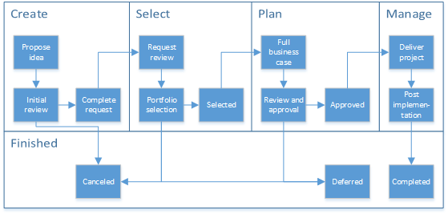

# Using workflow for demand management in Project Online

This article describes how demand management is implemented in Project Web App.
  
You can use the demand management tools in Project Web App to capture all project ideas in one place, and then guide them through a decision-making process catered to your business's needs. Using these tools can help your users make decisions about which proposals to approve, and track progress on a project until the work is completed.
  
Demand management in Project Online uses:
  
- **Project detail pages** - Project Web App pages where users can view and update project information. 
    
- **Stages** - sets of project detail pages specific to one area of the project lifecycle. 
    
- **Phases** - a way to organize multiple stages. 
    
- **Workflows** - a way to enforce your business processes as projects move through the various phases and stages. 
    
- **Enterprise project types** - a way to bring phases, stages, and project detail pages together with a workflow into a standardized way of doing a project. 
    
We'll go over each of these in the sections that follow.
  
## Project detail pages

Project Web App users view or update project data on project detail pages. You can customize a project detail page by choosing web parts that use the fields you want displayed. In demand management, project detail pages are displayed to the user at various stages of a project whenever you need to gather information from or display information to a user.
  
## Stages

A stage includes one or more project detail pages, grouped to gather information about a project. This information can be used or updated by a workflow.
  
In Project Web App, you can define which project detail pages are displayed in a given stage, which fields are required and which are read/write or read-only, and which phase (we'll talk about phases in the next section) the stage is part of.
  
For each stage of a project, we recommend that you define what actions need to take place and what information needs to be gathered based on your business requirements for the project. This information will help you define the list of fields that you need to display in the project detail pages and what actions you need the workflow to take. The following steps list the general procedure:
  
1. Define what needs to happen with the project in each stage
    
2. Define the required information that you want to capture using project detail pages
    
3. Define the state of the fields in each stage (Required, read/write, or read-only)
    
## Phases

A demand management phase is used to organize multiple stages that make up a common set of activities in the project life cycle. Examples of phases are project creation, project selection, and project management (represented in the default Project Web App phases as Create, Select, and Manage). The phases themselves are just a way of organizing your stages and do not determine the order in which the stages are executed. (The order of the stages is determined by the associated workflow.)
  
See [Best practices for creating phases and stages](best-practices-for-creating-phases-and-stages.md) for more information. 
  
## Workflows

Workflows enforce your business processes and provide a structured way for projects to move through phases and stages. You can set up a workflow to do a variety of actions based on the user input for each stage, including sending emails, assigning tasks, and waiting for specific project actions.
  
For example, you might have an "Initial Proposal" stage where you include a project detail page with a custom field for project cost. You could configure the workflow to automatically accept or reject the project based on whether the project cost exceeds a certain limit.
  
The image below shows the five phases of demand management that are included in Project Web App and how they fit together. Within each phase are example stages such as "Propose idea" and "Initial review." Each stage can have one or more associated project detail pages. The entire collection of stages represents a single workflow that can be associated with an enterprise project type.
  

  
There are four general steps to perform to create your workflow in Project Web App:
  
1. Design the workflow based on your business requirements.
    
2. Create the needed custom fields, project detail pages, phases, and stages in Project Web App.
    
3. Create the workflow in SharePoint Designer 2013 and deploy it to Project Web App.
    
4. Create an enterprise project type that uses the workflow.
    
## Enterprise project types

An enterprise project type brings together all the elements of demand management by combining a single workflow with its phases and stages with department and project site template definitions. Normally, enterprise project types are aligned with individual departments, for example, marketing projects, IT projects, or HR projects. Using enterprise project types helps to categorize projects within the same organization that have a similar project life cycle. For a user, the enterprise project types appear in a drop-down list when the user clicks **New Project** in the Project Center. 
  

