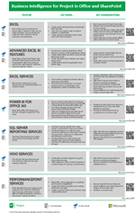

# What reporting tools can I use with project data?

 *[\< More Project help](project-help.md)* 
  
If you're using Project Web App, you might be wondering what tools you can use to create reports. Whether you're using Project Web App for Project Server 2013 or Project Web App for Project Online, you have several options available for viewing and creating reports. You can:
  
- [Sample reports in Project Web App](what-reporting-tools-can-i-use-with-project-data.md#__sample_reports_in) that come automatically with Project Web App to get ideas about basic reports 
    
- [Excel business intelligence features ](what-reporting-tools-can-i-use-with-project-data.md#__excel_business_intelligence) that include charts, tables, and views 
    
- [Reports in Project 2013](what-reporting-tools-can-i-use-with-project-data.md#__reports_in_project)
    
- [SQL Server Reporting Services](what-reporting-tools-can-i-use-with-project-data.md#__sql_server_reporting) (provided your organization has Reporting Services set up) 
    
- Use other tools, such as PerformancePoint Services or [Visio Services](what-reporting-tools-can-i-use-with-project-data.md#__visio_services) (if your organization has these service applications set up and you have access to your project data in these tools) 
    
The sections below provide more information about reporting options for project data. To download a poster that summarizes all of these tools, see [Business intelligence for Project in Office and SharePoint](https://download.microsoft.com/download/8/d/6/8d65bb82-828e-4202-8829-89353b4ed12f/AF104195754_en-us_projectbi_handout_2014.pdf
). 
  

  
## Sample reports in Project Web App

 Project Web App for Project Online comes with several sample reports that you can use a starting point. These include: 
  
- **Project Overview Dashboard**, which provides high-level information about projects, including start and finish dates, risks, issues, and tasks. This dashboard was created by using Power View in Microsoft Excel 2013. You must have Silverlight installed on your computer in order to view the workbook.
    
- **Project Overview**, which provides high-level information about projects, such as percent complete, number of assignments, and number of tasks. This report was created by using Power Pivot.
    
- **Resource Overview**, which provides high-level information about projects, including number of hours worked and number of tasks by resource. This report was created by using Power Pivot.
    
If you're using Project Web App for Project Server 2013 (on premises), even more sample reports are available. 
  
To learn more about the sample reports, see [Sample reports in Project Online](https://support.office.com/article/ceab4edc-13f4-4b64-81e1-a0f3a5c607bc).
  
## Excel business intelligence features

Excel 2013 has lots of great business intelligence (BI) features. These include: 
  
- [Use AutoFill and Flash Fill](https://support.office.com/article/2e79a709-c814-4b27-8bc2-c4dc84d49464), which enables you to format a column of data a particular way without having to use a complex formula. For example, if you have a column that contains a list of dates and times, and you want a column that contains just dates, you can use Flash Fill to make that change. 
    
- [Analyze your data instantly](https://support.office.com/article/9e382e73-7f5e-495a-a8dc-be8225b1bb78), which enables you to select a range of data and instantly see possible ways to display that data
    
- [Create a PivotTable timeline to filter dates](https://support.office.com/article/d3956083-01be-408c-906d-6fc99d9fadfa) and [slicers](https://support.office.com/article/01832226-31B5-4568-8806-38C37DCC180E .aspx) that enable people to view more specific information in PivotTable reports or PivotChart reports 
    
See [Creating charts from start to finish](https://support.office.com/article/36f8a2b7-0f74-4d40-942d-bc2e42436d73). 
  
Many other BI features are available, including Power Query, Power Pivot, Power View, and Power Map. See the following resources for more details:
  
- If you're using Project Online (in the cloud), see [BI capabilities in Excel and Office 365](https://support.office.com/article/26c0548e-124c-4fd3-aab3-5f64568cb743).
    
- If you're using Project Server (on premises), see [Business intelligence in Excel and Excel Services (SharePoint Server 2013)](https://support.office.com/article/2740f10c-579d-4b40-a1d9-7beb5d38547c).
    
## Reports in Project 2013

If you're using Project 2013, you have a wide variety of reports available on the **Report** tab. 
  

  
See [Pick the right report in Project 2013](https://support.office.com/article/61324235-aaec-4eef-acab-4c5245fedaeb) for an overview of the different reports that are available. 
  
See [Create a project report](https://support.office.com/article/6e74dc79-0e2d-480b-b600-3a466bf289a3) to learn how to create reports in Project 2013. 
  
## SQL Server Reporting Services

Reporting Services is a powerful reporting platform that is available with SQL Server. Some customers prefer to use Reporting Services to create and share reports. Typically, IT administrators and developers create Reporting Services reports, and then share those reports using SharePoint or a Reporting Services report server. See [SQL Server Reporting Services tools](https://technet.microsoft.com/library/ms155792).
  
## PerformancePoint Services in SharePoint Server 2013

PerformancePoint Services in SharePoint Server 2013 is a great tool for creating power key performance indicators (KPIs), scorecards, reports, and dashboards. Ideal for (on premises) data stored in SQL Server Analysis Services, PerformancePoint Services enables you to create interactive, reusable dashboard items. See [TechNet Article: Create dashboards (PerformancePoint Services in SharePoint Server 2013)](https://technet.microsoft.com/library/jj571736%28v=office.15%29.aspx).
  
## Visio Services

You can use Visio to create a data-connected diagram, and then share it with others by using Visio Services in SharePoint. See [A beginner's guide to Visio](https://support.office.com/article/bc1605de-d9f3-4c3a-970c-19876386047c) and [TechNet Article: Overview of Visio Services in SharePoint Server 2013](https://technet.microsoft.com/library/ee663485.aspx). 
  

