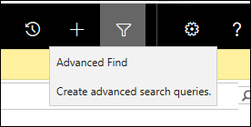
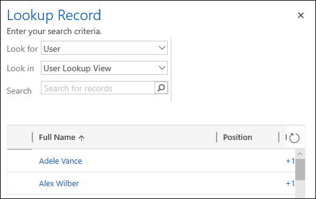

# Access a project in Project for the web after the Office 365 group has been deleted

If the Office 365 group that you are sharing your Project for the web project with is deleted, users in the group will not be able to access the project.  However, there are ways for you to regain access.

- The group owner can restore the Office 365 group.
- An admin can reassign the project to a user or Office 365 group.

The option you should choose depends on how long ago the group was deleted.

## Restore the Office 365 group

If a group that you own has been deleted, it will be retained for 30 days by default. This 30-day period is considered a "soft-delete" because you can still restore the deleted group. After 30 days, the group and its associated contents are permanently deleted and cannot be restored.

If you are the owner of an Office 365 group, you can restore the group yourself by following these steps.

1. On the [**Deleted groups** page](https://outlook.office.com/people/group/deleted), select the **Manage groups** option under the **Groups** node, and then choose **Deleted**.
2. Click on the **Restore** tab next to the group you want to restore.

After you've restored the group, members of the group should be able to access the associated project in Project for the web.

> [!Note]
> To learn more about deleting an Office 365 group, see [Restore a deleted Office 365 Group](https://docs.microsoft.com/office365/admin/create-groups/restore-deleted-group?view=o365-worldwide)

## Reassign the project

If the Office 365 group has been deleted for longer than 30 days, it is not restorable and you will need an admin in your tenant to help you with reassigning the project to either:

- The user that needs to access the project
- An active Office 365 group with members who need to access the project.

The admin will need to:
1. Find the project through the Advanced Find search function in the Dynamics 365 Admin Center.
2. Assign the project to the user who needs to access it. 

### Find the project in Advanced Find search

Use [Dynamics 365 Advanced Find search](https://docs.microsoft.com/dynamics365/customer-engagement/basics/save-advanced-find-search) to look for the project you need.

1.	In the Dynamics 365 Administration Center, select the default instance, and then click **Open**.
2.	On the PowerApps Settings page, select **Dynamics 365 Custom**.
3.	On the **Projects** page, click the filter icon in the menu bar and then select **Advance Find**.

    
4.	In Advanced Find, in the **Look for** menu, select **Projects**.  In the **Use Saved View** menu, select **All projects**.
   
 
5.	Click **Select**, and from the menu, select **Name**.  From the next menu, select **Equals**, and then in the **Enter text** box type the name of the project you are looking for. 
 

6. Click **Results** to run the query. The project you are looking for should display in the Projects tab.

## Reassign the project 

After locating the project through Advanced Find, the admin can now reassign the project to a user or group. 

To reassign a project to a user or Office 365 group: 

1. Select the checkbox next to the project name.
2. In the ribbon, click **Assign Projects**.
 
3. On the **Assign Project** screen, click in the **Assign to** box to change it to **User or team**.
4. Click in the **User or team** box, and then click the magnifying glass icon. Then scroll to the bottom of the results and click on **Look up more records**.
5.  On the **Lookup Record** screen:
- If you want to reassign the project to a user, select **User** in the **Look for** menu, select the user from the user list, and then click **Add**.

 

- If you want to reassign the project to an Office 365 group, select **Team** from the **Look for** menu, select **All AAD Office Group Teams** from the **Look in** menu, select the group from the list, and then click **Add**.

 

## See Also
  
  

