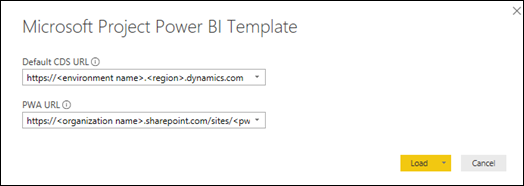
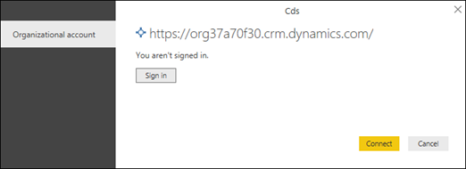
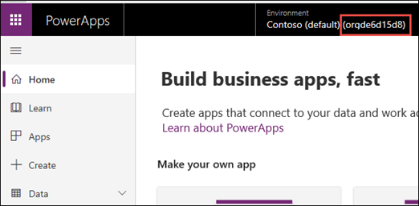
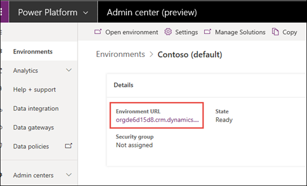
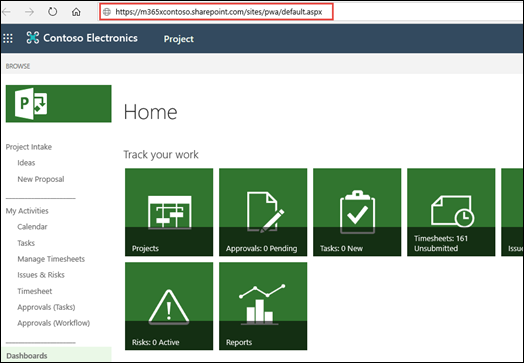

# Connect to Project data through Power BI Desktop

You can use the Project Power BI template to import and analyze data from Project for the web and Project Online into Power BI. The template is designed to help you quickly connect to your Default Common Data Service (CDS) instance in Dynamics 365 where your Project for the web data is stored, as well as connect to your Project Web App tenant in Office 365.  You will be able to download a variety of data to visually explore and monitor all the key aspects of your PPM deployment. There are multiple visually rich report pages for the portfolio, resource, and project overview.

## Get started 
You first need to do the following:

- Download [Power BI Desktop](https://go.microsoft.com/fwlink/?LinkID=521662), then run the installer to get **Power BI Desktop** on your computer.
- Download the [Project Power BI template](https://aka.ms/ProjectReports) to your computer. The file name of the template file is **Microsoft Project Power BI Template.pbit**.
 
To use the template, you need the following:

- A Project Plan 3 (previously named Project Online Professional) or Project Plan 5 (previously named Project Online Premium) subscription.
- A Power BI Desktop or Power Bi Pro subscription.

## Launch and configure the Power BI Desktop template file
1. Click on the Project Power BI template file to open it in Power BI Desktop.
2. On the **Enter Parameters** screen, in the **Default CDS URL** field, type the URL of your Dynamics 365 Common Data Service (CDS) default instance you are using for Project for the web. 
3. In the **PWA URL** field, type the URL of your Project Online Project Web App site.  For example, https://<spam><spam>contoso.sharepoint<spam><spam>.com/sites/PWA. Then click **Load**. 

4.  Power BI Desktop will prompt you to authenticate with your Office 365 account. Select **Organizational account**, click **Sign In**, and enter your credentials. 

5.  A message will display telling you that your data is loading. Depending on the number of projects, tasks, and resources in your system, this may take some time. 

### How to determine your Default CDS URL

 Project for the web data is stored in the Dynamics 365 Common Data Service (CDS). You need to enter the URL of your default CDS instance that you are using, and it needs to be in the following format: 

https://<spam><spam>(environment_name).(region).dynamics<spam><spam>.com

For example:
https://<spam><spam>orgde6d15d8.crm.dynamics<spam><spam>.com

The following will tell you how to find the *environment_name* and the *region* values of the URL.

**To determine the Default CDS environment name value of the URL**:

1. While logged into Office 365, go to this site:  https://<spam><spam>web.powerapps<spam><spam>.com
2. On the PowerApps page, note the value in the **Environments** section.  In the image below, the default CDS environment value is **orgde6d15d8**.

    

**To determine the region value of the URL**:

The region value will usually be associated to the data center that is close to you geographically. The following list shows the region values associated with regional data centers.

|||
|:-----|:-----|
|**Region**   |**Value**   |
|North America     |crm   |
|South America   |crm2    |
|Canada     |crm3   |
|Europe, Middle East and Africa (EMEA)    |crm4  |
|Asia Pacific Area (APAC)    |crm5   |
|Oceania     |crm6   |
|Japan     |crm7   |
|India    |crm8   |
|North America 2     |crm9   |
|United Kingdom     |crm11   |
|France    |crm12   |

If you are not sure, check with your Office 365 administrator and have them check for the value in the [Power Platform Admin Center](https://docs.microsoft.com/power-platform/admin/admin-guide).

### How to determine your Project Web App (PWA) URL

You can go to your Project Online PWA site home page to find the PWA site URL.

You can get to your PWA site by:

1. In Office 365, click the Apps icon in the top left corner, and then in **Apps**, select **Project**.
2. On your Project Home page, on the bottom of the page, click, **Go to Project Online**. This will take you to your PWA Home page.
3. Copy the URL in your browser and use this value for the **PWA URL** field in the Project template.

 

If you are still not sure, check with your Office 365 admin and have them check for the value in the SharePoint admin center.

## After connecting to your data

After Power BI Desktop retrieves the data, the visualizations in each report page will load and display the data.  

> [!Note]
> You need to have read permissions at the business-unit level to the CDS entities to which the report connects to have a portfolio-level view of the data.  

From the Power BI Desktop, we recommend [publishing the report to a shared workspace](https://docs.microsoft.com/power-bi/desktop-upload-desktop-files), and then [configure scheduled refresh of the data to keep your dataset up to date](https://docs.microsoft.com/power-bi/refresh-scheduled-refresh).

## See also

[Compose HTTP requests and handle errors](https://docs.microsoft.com/powerapps/developer/common-data-service/webapi/compose-http-requests-handle-errors#web-api-url-and-versions)

  

