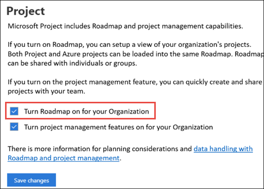

# Project for the web and the Dynamics 365 Common Data Service

Project for the web and it's Roadmap feature are built on the [Microsoft Power Platform](https://powerplatform.microsoft.com/). The Power Platform consists of [PowerApps](https://powerapps.microsoft.com), [Microsoft Flow](https://preview.flow.microsoft.com), [Power BI](https://powerbi.microsoft.com), and the [Common Data Service (CDS)](https://docs.microsoft.com/powerapps/maker/common-data-service/data-platform-intro). Project for the web and Roadmap data are stored in CDS.  

## Data retention

Since Project for the web and Roadmap data are stored in CDS, data retention policies differ from Project Online (whose data is stored in Office 365).  When your Project Online subscription ends, your data is retained for 90 days before it is automatically deleted (in accordance to Office 365 data retention policies).  However, if you used Project for the web (which is included in Project Online Premium and Professional license), that data is not automatically deleted 90 days after your subscription ends. 

Need to link to more data about Dynamics 365 data retention. 

## Where is my data located

If your users have access to Project for the web or Roadmap in your Microsoft 365 tenant, a default Dynamics 365 CDS instance is provided to your tenant.  Project for the web and Roadmap data (such as project or roadmaps) are stored in solutions in the default instance.

Admins can find the name and details of their default Dynamics 365 CDS instance in the PowerApps admin center (admin.powerapps.com).  

### Deleting user data

If you need to delete Project for the web or Roadmap data (for example, you need to delete data for a specific user) an admin can choose to [manually delete](delete-user-data-from-project-for-the-web.md) it.

## Turn off Project for the web

An admin can choose to turn off Project for the web throughout the organization or to specific users:

- [Turn Project for the web off to individual users](https://review.docs.microsoft.com/project-for-the-web/turn-project-for-the-web-off?branch=efrene-v2working#turn-off-project-for-the-web-for-specific-users-in-your-organization). This can be done through the Microsoft 365 admin center or through Windows PowerShell.
- [Turn Project for the web off to the entire organization](https://review.docs.microsoft.com/project-for-the-web/turn-project-for-the-web-off?branch=efrene-v2working#turn-off-project-for-the-web-for-your-organization). This is done through the Project Settings page in the Microsoft 365 admin center.

## Turn off Roadmap 

If you want to turn off Project for the web for your organization, but still allow your users access to Roadmap, you can do this through the Project settings page:

## See Also
  
[Turn Roadmap on or off](Turn-roadmap-on-or-off.md) 
[Turn Project for the web off](turn-project-for-the-web-off.md) 
[Project for web get started guide for admins](project-for-the-web-get-started-guide-for-admins.md)

